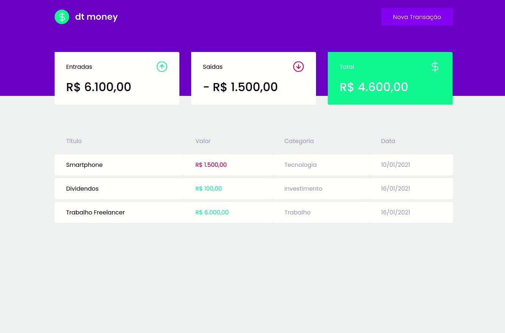

# dt money

Aplicação dt money foi criada na trilha de ReactJS do Ignite da Rocketseat. A aplicação é responsável por cadastrar, listar e apresentar um balanço financeiros do usuário.

Para realizar um cadastro basta clicar em Nova Transação.

# Imagem da aplicação

<p align="center">
  
</p>

## Execução

Dentro da pasta do projeto, execute

```bash
yarn
```

```bash
yarn start
```

## Licença

[MIT](https://choosealicense.com/licenses/mit/)
